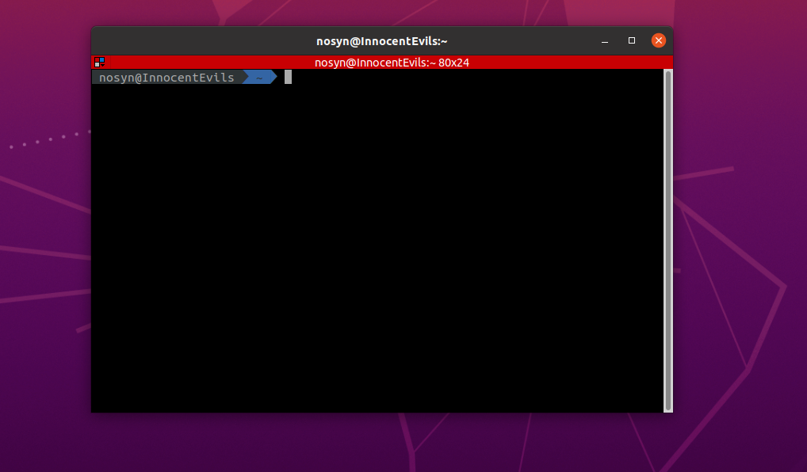

I've been using Ubuntu for 7 months since I first started my first job [@PlusOne Robotics](https://plusonerobotics.com/) as a web developer. I found that knowing some shortcuts can help me saving a lot of time. The purpose of this article is to summary hot key shortcuts that I've found useful as well as keeping a note for myself. I'm also using Windows for gaming and coding on my personal laptop. I will leave a note if the shortcut is working on Windows also.

> ** `Super` is your Windows key on keyboard. Usually a button next to the left Ctrl key**

#### 1. Open Ubuntu terminal: `Ctrl + Alt + T`

Want to open new terminal fast? `Ctrl + Alt + T` will help you open terminal fast from anywhere on Ubuntu.

### 2. Show desktop: `Super + D` or `Ctrl + Alt + D`

This shortcut will collapse all of your running applications to the taskbar and show desktop. Do it again will bring back all your previous running applications to the screen. This is like the toggle between your running applications and desktop. _`Super + D` is also working on Windows_ 😁

### 3. Lock Screen: `Super + L`

This one is one of the most basic shortcut but I've never known until one of my colleague told me to use that.

### 4. Show application menu: `Super + A`

This one is similar to home button on smart phone. It shows all the applications and system settings that you on your machine.

### 5. Switching between applications: `Super + Tab` or `Alt + Tab`

Switching between running application windows on your machine. Press and hold the key `Super` or `Alt` then tapping the `Tab` key allows you navigating between windows.

### 6. Snap windows: `Super + Arrow key`

It's super useful as a web developer for me. I can split a screen into 2 so I can have 2 application running on the same screen

### 7. Move application to another screen (working with multiple screen): `Super + Shift + Arrow`

It's useful when you want to move an application to another screen. It's also working with snap windows.

### 8. Close application: `Ctrl + W` or `Ctrl + Q`

It's a hot key to close an application. `Ctrl + W` close all the tabs (Eg: Chrome tabs) before it actually close the application.

### Summary

That's all the keyboard that I learnt and have been using in my career so far. You can update keyboard preference on the user setting. I will update this page regularly whenever I find something awesome.
